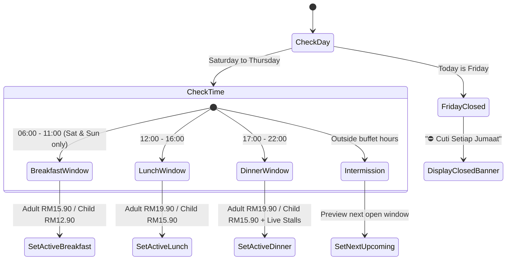
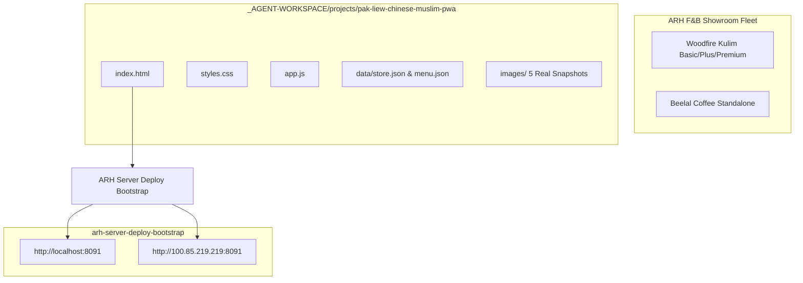

# Functional Design & Architecture Specification

**Project:** Pak Liew Chinese Muslim Restaurant PWA  
**Architecture:** Ports & Adapters / Modular Vanilla Webapp (CF Workers & Static Host Compatible)  
**State Machine:** Time-Aware Session Router & Group Reservation Engine  

---

## 1. Executive Summary & Purpose

Pak Liew Chinese Muslim Restaurant is a high-volume All-You-Can-Eat Chinese-Muslim buffet located at Titiwangsa Sentral, Kuala Lumpur. Unlike single ala-carte restaurants, Pak Liew operates across **3 distinct dining timeframes** with distinct pricing and menu offerings (including specialized evening Live Wok stalls).

The functional design of this PWA bridges customer decision-making by providing:
1. **Zero-Friction Discovery:** Immediate clarity on current operational status, buffet pricing, and session hours.
2. **Interactive Group Booking:** Self-service calculation for large dining parties (>10 pax) with instant WhatsApp dispatch.
3. **Menu Transparency:** Detailed browsing of signature dishes, dim sum varieties, and live cooking stations.
4. **Complete Decoupling:** Standalone codebase isolated from the Woodfire showroom fleet.

---

## 2. Dynamic Session State Machine

The client application includes an autonomous clock-driven session detector:



### Session Definitions Table
| Session ID | Days Active | Hours | Adult Price | Child Price | Core Offerings |
| :--- | :--- | :--- | :--- | :--- | :--- |
| `breakfast` | Sat & Sun | 06:00 – 11:00 | RM 15.90 | RM 12.90 | Nasi Lemak, Ayam Rendang, Paru Berlado, Roti Sarang Burung, Mantou, Dimsum. |
| `lunch` | Sat – Thu | 12:00 – 16:00 | RM 19.90 | RM 15.90 | Udang Nestum, Daging Black Pepper, Sweet & Sour Fish, Nyonya Curry, Pastas. |
| `dinner` | Sat – Thu | 17:00 – 22:00 | RM 19.90 | RM 15.90 | **Live Stalls**: Char Koay Teow, Char Koay Kak, Chee Cheong Fun, Satay, Ice Cream. |
| `closed` | Every Friday | All Day | N/A | N/A | Closed for weekly rest & kitchen maintenance. |

---

## 3. Data Schema Specifications

### 3.1 Store Configuration (`data/store.json`)
```json
{
  "store": {
    "slug": "pak-liew-chinese-muslim",
    "name": "Pak Liew Chinese Muslim Restaurant",
    "tagline": "Buffet Paling Padu di KL • All-You-Can-Eat Chinese Muslim Cuisine",
    "phone": "+60162493449",
    "whatsapp": "60162493449",
    "address": "60, Jalan Lumut, Titiwangsa Sentral, 50400 Kuala Lumpur",
    "landmark": "Bersebelahan Hokkaido Seafood KL",
    "waze": "PAK LIEW CHINESE MUSLIM TITIWANGSA",
    "googleMapsUrl": "https://maps.google.com/?q=60,+Jalan+Lumut,+Titiwangsa+Sentral,+50400+Kuala+Lumpur",
    "closedDay": "Friday (Cuti Jumaat)",
    "currency": "RM",
    "locale": "ms-MY",
    "sessions": [ ... ]
  }
}
```

### 3.2 Menu Schema (`data/menu.json`)
Items contain bilingual naming, category mapping, session tagging, and photo asset links:
```json
{
  "id": "live-ckt",
  "categoryId": "live-stalls",
  "name": "Char Koay Teow (Wok Hei Panas)",
  "chineseName": "炒粿条",
  "price": 0,
  "priceNote": "Termasuk dlm Buffet",
  "session": "dinner",
  "badge": "Chef Special",
  "isSpicy": true,
  "description": "Koay teow digoreng panas atas kuali besar dengan aroma wok hei padu, telur, taugeh segar & udang.",
  "image": "/images/snap-dinner-buffet.jpg"
}
```

---

## 4. Functional Subsystems

### 4.1 Client-Side Search & Multi-lingual Filter
* **Query Engine:** Real-time token matching across `name`, `chineseName`, and `description`.
* **Category Filtering:** Filter items by active category (`all`, `live-stalls`, `lunch-mains`, `dinner-mains`, `breakfast-mains`, `dimsum-buns`, `desserts-drinks`).
* **Empty State Handling:** Displays friendly recovery suggestions when search returns no matches.

### 4.2 Group Reservation Calculator
* **Mathematical Function:**
  $$	ext{Total} = (	ext{Adults} 	imes 	ext{Price}_{	ext{Adult}}) + (	ext{Children} 	imes 	ext{Price}_{	ext{Child}})$$
  Where rates dynamically adjust based on the selected session dropdown (`breakfast` vs `lunch`/`dinner`).
* **WhatsApp Payload Serializer:**
  Pre-formats WhatsApp message URI:
  ```
  Salam Pak Liew Chinese Muslim Restaurant! 👋

  Saya berminat untuk membuat tempahan kumpulan / meja:
  • Sesi: [Session Name]
  • Bilangan Dewasa: [X] orang
  • Bilangan Kanak-kanak: [Y] orang
  • Anggaran Jumlah: RM [Total]

  Boleh sahkan kekosongan meja untuk tarikh: [ Masukkan Tarikh & Masa ]? Terima kasih!
  ```

### 4.3 Navigation & Wayfinding Handlers
* **Waze Ingress:** Launches native Waze app via URL scheme `https://waze.com/ul?q=Pak%20Liew%20Chinese%20Muslim%20Titiwangsa`.
* **Google Maps Ingress:** Opens verified pin coordinates for `60, Jalan Lumut, Titiwangsa Sentral`.
* **Embedded Maps Frame:** Direct zero-cookie responsive iframe embed with lazy loading.

---

## 5. Decoupling & Deployment Architecture



* **No Git Mutation:** Changes remain entirely contained within `_AGENT-WORKSPACE/projects/pak-liew-chinese-muslim-pwa/`.
* **Zero Shared State:** Does not read or write to Woodfire Cloudflare Workers or shared Firebase databases.
* **Production Readiness:** The folder can be zipped or linked to its own standalone Cloudflare Workers project (`pak-liew-chinese-muslim`) at any time without dependencies on other projects.
